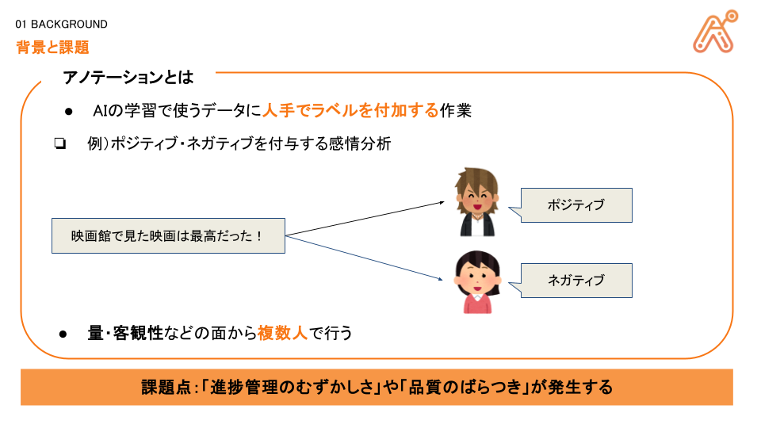
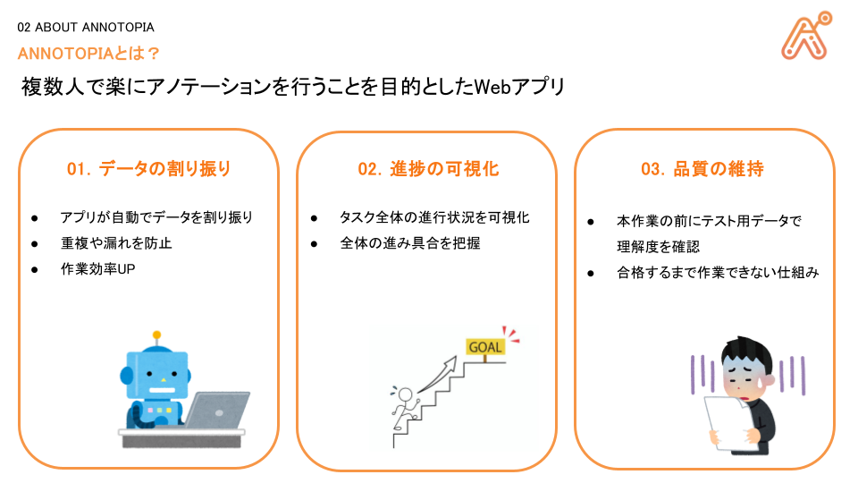
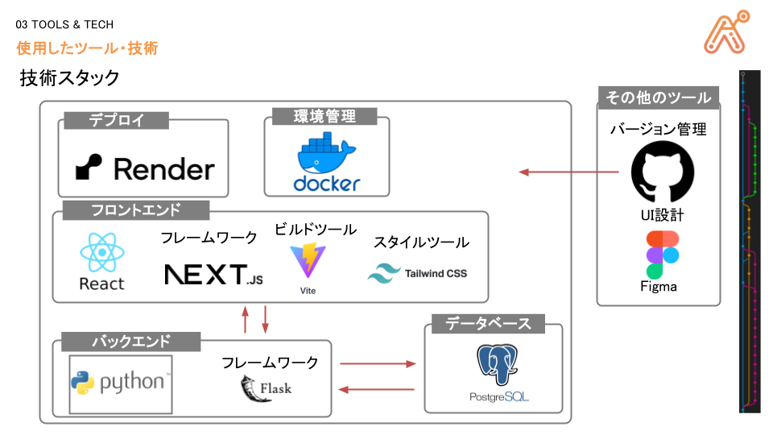

# Annotopia Ver.1.0.0 [[Link]](https://myapp-frontend-hdbq.onrender.com/)

複数人で楽にアノテーションを行うことを目的としたWebアプリです。

## 概要 > [[PDF]](./detail.pdf)
<table align=center>
  <tr>
    <td>
      
    </td>
  </tr>
</table>
<table align=center>
  <tr>
    <td>
      
    </td>
  </tr>
</table>

## 技術スタック
<table align=center>
  <tr>
    <td>
      
    </td>
  </tr>
</table>

## クレジット
作成者 
西田祥人：https://github.com/j329nish 
hamamoto：https://github.com/Hamamoto-Junnosuke 
nonomura：https://github.com/j341nono 

## ライセンス
MIT License 
Copyright (c) 2025 BakeryForHackathon

(最終更新 2025/07/28)